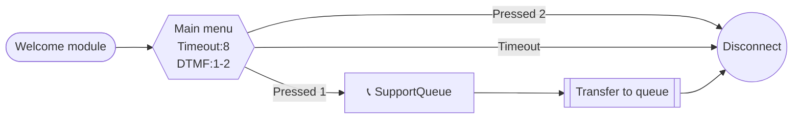

# connect-blueprint

> An Agent Skill for designing and generating Amazon Connect contact flows.

[](LICENSE)
[](https://agentskills.io)

## What this skill does

**connect-blueprint** gives AI agents the knowledge and tools to:

- **Design flows from scratch** — gather requirements, check your Connect environment, generate a Mermaid diagram, then produce a deployable flow JSON
- **Convert diagrams to flows** — turn draw.io XML, Mermaid diagrams, or screenshots into Amazon Connect flow JSON
- **Deploy to AWS** — create or update contact flows via AWS CLI
- **Auto-layout** — assign clean x/y coordinates using topological ordering (no more zigzag arrows)
- **Validate before deploy** — local structure checks + AWS API validation

## Quick Start

```
You: "Amazon Connectで営業時間判定付きのIVRフローを作って"

Agent: 
1. Connect環境を確認（キュー、プロンプト、Lambda一覧）
2. Mermaid設計図を生成 → レビュー依頼
3. 承認後、フローJSONを生成
4. バリデーション → デプロイ
```

## Compatibility

Works with any [Agent Skills](https://agentskills.io)-compatible agent:

| Agent | Installation |
|-------|-------------|
| **Claude Code** | `claude mcp add-skill https://github.com/ippei2480/connect-blueprint` |
| **Cursor** | Add to `.cursor/skills/` or reference in settings |
| **Gemini CLI** | Add SKILL.md path to your Gemini configuration |
| **Goose** | `goose skills add https://github.com/ippei2480/connect-blueprint` |
| **Roo Code** | Add to custom instructions or skill directory |

**Requirements:**
- AWS CLI with a valid profile (`connect:*` permissions)
- Python 3.8+

## Usage

### Mode A: Design from scratch

The agent will:
1. Ask about your call center's purpose, IVR options, queues, and Lambda integrations
2. Check your Connect environment (available queues, prompts, Lambda functions)
3. Generate a Mermaid diagram for your review
4. Convert the approved diagram to flow JSON with auto-layout
5. Deploy via AWS CLI

### Mode B: Convert from diagram

Provide a draw.io file, Mermaid diagram, or screenshot — the agent will parse it and generate flow JSON.

## Examples

Ready-to-use sample flows with Mermaid diagrams and deployable JSON:

| Example | Description | Key Features |
|---------|-------------|-------------|
| [Business Hours Routing](examples/business-hours-routing/) | 営業時間内外の振り分け | CheckHoursOfOperation |
| [Callback Reservation](examples/callback-reservation/) | 待ち時間が長い場合のコールバック予約 | Lambda連携, 条件分岐 |
| [NPS Survey](examples/nps-survey/) | 通話後の顧客満足度アンケート | DTMF 0-9, Lambda記録 |
| [VIP Escalation](examples/vip-escalation/) | VIP顧客の優先キュー振り分け | 顧客DB照合, 優先キュー |
| [Multilingual](examples/multilingual/) | 日本語/英語の言語選択対応 | 属性設定, 言語別IVR |
| [Inquiry Routing](examples/inquiry-routing/) | 問い合わせ種別振り分け | 4択IVR, リトライ |

## Scripts

```bash
# ローカルバリデーション
./scripts/validate.sh flow.json

# AWSバリデーション込み
./scripts/validate.sh flow.json --aws --instance-id $INSTANCE_ID --profile $PROFILE

# レイアウト座標付与
python3 scripts/layout.py flow.json

# ワンコマンドデプロイ（バリデーション→レイアウト→デプロイ）
./scripts/deploy.sh create flow.json --name "My Flow" --instance-id $INSTANCE_ID --profile $PROFILE
./scripts/deploy.sh update flow.json --flow-id $FLOW_ID --instance-id $INSTANCE_ID --profile $PROFILE
```

## Mermaid Notation

Connect-specific Mermaid notation where **node shapes map to ActionTypes**:

| Shape | Syntax | ActionType |
|-------|--------|-----------|
| Hexagon | `id{{"text"}}` | GetParticipantInput (IVR) |
| Rounded rect | `id("text")` | MessageParticipant (play audio) |
| Diamond | `id{"text"}` | Compare (condition branch) |
| Double rect | `id[["text"]]` | TransferContactToQueue |
| Parallelogram | `id[/"lambda:fn"/]` | InvokeLambdaFunction |
| Plain rect | `id["key=value"]` | UpdateContactAttributes |
| Stadium | `id(["text"])` | InvokeFlowModule |
| Circle | `id(("end"))` | DisconnectParticipant |



## References

| Document | Contents |
|----------|----------|
| [Action Types](references/action_types.md) | 各ActionTypeのパラメータ・JSON例 |
| [Flow JSON Structure](references/flow_json_structure.md) | トップレベル構造・バリデーションルール |
| [Mermaid Notation](references/mermaid_notation.md) | ノード形状→ActionType マッピング |
| [AWS CLI Commands](references/aws_cli_commands.md) | Connect関連CLIコマンド |
| [Layout Rules](references/layout_rules.md) | 座標付与アルゴリズム |
| [Error Handling Patterns](references/error_handling_patterns.md) | エラーハンドリングのベストプラクティス |
| [Connect Limits](references/connect_limits.md) | APIの制限・注意点 |

## Layout Algorithm

Positions are assigned automatically using a topological sort:
- **Forward rule**: every transition increases the x coordinate
- **NextAction (default)**: same y as parent
- **Conditions[i]**: parent y + (i+1) × 200
- **Errors**: below conditions

Loops are detected via DFS and excluded from layout calculation.

## Contributing

See [CONTRIBUTING.md](CONTRIBUTING.md) for guidelines.

## License

MIT
