# connect-blueprint

> An Agent Skill for designing and generating Amazon Connect contact flows.

## What this skill does

**connect-blueprint** gives AI agents the knowledge and tools to:

- **Design flows from scratch** — gather requirements, check your Connect environment, generate a Mermaid diagram, then produce a deployable flow JSON
- **Convert diagrams to flows** — turn draw.io XML, Mermaid diagrams, or screenshots into Amazon Connect flow JSON
- **Deploy to AWS** — create or update contact flows via AWS CLI
- **Auto-layout** — assign clean x/y coordinates using topological ordering (no more zigzag arrows)

## Compatibility

Works with any [Agent Skills](https://agentskills.io)-compatible agent, including:
Claude Code, Cursor, Gemini CLI, Goose, Roo Code, and others.

**Requirements:**
- AWS CLI with a valid profile (`connect:*` permissions)
- Python 3.8+

## Usage

### Mode A: Design from scratch

The agent will:
1. Ask about your call center's purpose, IVR options, queues, and Lambda integrations
2. Check your Connect environment (available queues, prompts, Lambda functions)
3. Generate a Mermaid diagram for your review
4. Convert the approved diagram to flow JSON with auto-layout
5. Deploy via AWS CLI

### Mode B: Convert from diagram

Provide a draw.io file, Mermaid diagram, or screenshot — the agent will parse it and generate flow JSON.

## Installation

### Claude Code
Add to your project's `CLAUDE.md`, or install via:
```bash
claude skills add https://github.com/ippei2480/connect-blueprint
```

### Other agents
Download the skill and follow your agent's skill installation instructions.

## Mermaid notation

This skill uses a Connect-specific Mermaid notation where **node shapes map to ActionTypes**:

| Shape | Syntax | ActionType |
|-------|--------|-----------|
| Hexagon | `id{{"text"}}` | GetParticipantInput (IVR) |
| Rounded rect | `id("text")` | MessageParticipant (play audio) |
| Diamond | `id{"text"}` | Compare (condition branch) |
| Double rect | `id[["text"]]` | TransferContactToQueue |
| Parallelogram | `id[/"lambda:fn"/]` | InvokeLambdaFunction |
| Plain rect | `id["key=value"]` | UpdateContactAttributes |
| Stadium | `id(["text"])` | InvokeFlowModule |
| Circle | `id(("end"))` | DisconnectParticipant |

```mermaid
graph LR
  greeting(["Welcome module"])
  menu{{"Main menu\nTimeout:8\nDTMF:1-2"}}
  q1["📞 SupportQueue"]
  transfer[["Transfer to queue"]]
  end1(("Disconnect"))

  greeting --> menu
  menu -->|"Pressed 1"| q1
  menu -->|"Pressed 2"| end1
  menu -->|"Timeout"| end1
  q1 --> transfer
  transfer --> end1
```



## Layout algorithm

Positions are assigned automatically using a topological sort:
- **Forward rule**: every transition increases the x coordinate
- **NextAction (default)**: same y as parent
- **Conditions[i]**: parent y + (i+1) × 200
- **Errors**: below conditions

Loops are detected via DFS and excluded from layout calculation.

## License

MIT
