# connect-blueprint

> An Agent Skill for designing and generating Amazon Connect contact flows.

[](LICENSE)
[](https://agentskills.io)

## What this skill does

**connect-blueprint** gives AI agents the knowledge and tools to:

- **Design flows from scratch** — gather requirements, check your Connect environment, generate a Mermaid diagram, then produce a deployable flow JSON
- **Convert diagrams to flows** — turn draw.io XML, Mermaid diagrams, or screenshots into Amazon Connect flow JSON
- **Deploy to AWS** — create or update contact flows via AWS CLI (SAVED → ACTIVE 2-step deploy)
- **Auto-layout** — assign clean x/y coordinates using topological ordering (no more zigzag arrows)
- **Validate before deploy** — 3-layer validation: AWS MCP parameter check + local structure checks + AWS API validation

## Quick Start

```
You: "Amazon Connectで営業時間判定付きのIVRフローを作って"

Agent:
1. Connect環境を確認（キュー、プロンプト、Lambda一覧）
2. Mermaid設計図を生成 → レビュー依頼
3. 承認後、フローJSONを生成（AWS MCPでパラメータ検証）
4. バリデーション → デプロイ（SAVED → ACTIVE）
```

## Compatibility

Works with any [Agent Skills](https://agentskills.io)-compatible agent:

| Agent | Installation |
|-------|-------------|
| **Claude Code** | `claude mcp add-skill https://github.com/ippei2480/connect-blueprint` |
| **Cursor** | Add to `.cursor/skills/` or reference in settings |
| **Gemini CLI** | Add SKILL.md path to your Gemini configuration |
| **Goose** | `goose skills add https://github.com/ippei2480/connect-blueprint` |
| **Roo Code** | Add to custom instructions or skill directory |

**Requirements:**
- AWS CLI with a valid profile (`connect:*` permissions)
- Python 3.8+

## Usage

### Mode A: Design from scratch

The agent will:
1. Ask about your call center's purpose, IVR options, queues, and Lambda integrations
2. Check your Connect environment (available queues, prompts, Lambda functions)
3. Generate a Mermaid diagram for your review
4. Convert the approved diagram to flow JSON with auto-layout
5. Validate and deploy via AWS CLI (SAVED → ACTIVE 2-step)

### Mode B: Convert from diagram

Provide a draw.io file, Mermaid diagram, or screenshot — the agent will parse it and generate flow JSON.

## Scripts

```bash
# ローカルバリデーション
./scripts/validate.sh flow.json

# レイアウト座標付与
python3 scripts/layout.py flow.json

# ワンコマンドデプロイ（バリデーション→レイアウト→SAVED作成→ACTIVE化）
./scripts/deploy.sh create flow.json --name "My Flow" --instance-id $INSTANCE_ID --profile $PROFILE
./scripts/deploy.sh update flow.json --flow-id $FLOW_ID --instance-id $INSTANCE_ID --profile $PROFILE
```

## Validation

3層バリデーション構造：

| Layer | 方法 | 検証内容 |
|-------|------|----------|
| AWS MCP | `aws___read_documentation` | ActionType別パラメータの正確性 |
| ローカル | `./scripts/validate.sh` | JSON構造・遷移整合性・孤立ブロック・デッドエンド |
| Connect API | `./scripts/validate.sh --api` | ActionType固有のパラメータ制約 |

## Mermaid Notation

Connect-specific Mermaid notation where **node shapes map to ActionTypes**:

| Shape | Syntax | ActionType |
|-------|--------|-----------|
| Hexagon | `id{{"text"}}` | GetParticipantInput (IVR) |
| Rounded rect | `id("text")` | MessageParticipant (play audio) |
| Diamond | `id{"text"}` | Compare (condition branch) |
| Double rect | `id[["text"]]` | TransferContactToQueue |
| Parallelogram | `id[/"lambda:fn"/]` | InvokeLambdaFunction |
| Plain rect | `id["key=value"]` | UpdateContactAttributes |
| Stadium | `id(["text"])` | InvokeFlowModule |
| Circle | `id(("end"))` | DisconnectParticipant |

```mermaid
graph LR
  greeting(["Welcome module"])
  menu{{"Main menu\nTimeout:8\nDTMF:1-2"}}
  q1["📞 SupportQueue"]
  transfer[["Transfer to queue"]]
  end1(("Disconnect"))

  greeting --> menu
  menu -->|"Pressed 1"| q1
  menu -->|"Pressed 2"| end1
  menu -->|"Timeout"| end1
  q1 --> transfer
  transfer --> end1
```



## References

| Document | Contents |
|----------|----------|
| [Action Types](references/action_types.md) | 共通ルール・AWS Docs URLパス対応テーブル |
| [Flow JSON Structure](references/flow_json_structure.md) | トップレベル構造・バリデーションルール |
| [Mermaid Notation](references/mermaid_notation.md) | ノード形状→ActionType マッピング |
| [AWS CLI Commands](references/aws_cli_commands.md) | Connect関連CLIコマンド（2ステップデプロイ） |
| [Layout Rules](references/layout_rules.md) | 座標付与アルゴリズム |
| [Error Handling Patterns](references/error_handling_patterns.md) | エラーハンドリングのベストプラクティス |
| [Connect Limits](references/connect_limits.md) | APIの制限・注意点 |

## Layout Algorithm

Positions are assigned automatically using a topological sort:
- **Forward rule**: every transition increases the x coordinate
- **NextAction (default)**: same y as parent
- **Conditions[i]**: parent y + (i+1) × 200
- **Errors**: below conditions

Loops are detected via DFS and excluded from layout calculation.

## Contributing

See [CONTRIBUTING.md](CONTRIBUTING.md) for guidelines.

## License

MIT
