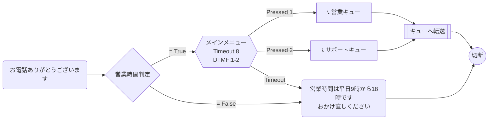

# 営業時間内外振り分けフロー

営業時間（平日9:00-18:00）を判定し、時間内はIVRメニューへ、時間外は音声ガイダンスを流して切断するフロー。

## フロー概要

1. 着信→挨拶メッセージ再生
2. 営業時間を判定（CheckHoursOfOperation）
3. **営業時間内**: IVRメニュー → キュー振り分け
4. **営業時間外**: 時間外ガイダンス再生 → 切断

## Mermaid 設計図



## 使い方

1. Connect管理画面でオペレーション時間（Hours of Operation）を設定
2. `flow.json` 内のキューARNとオペレーション時間ARNを自分の環境に合わせて変更
3. デプロイ前にバリデーション:
   ```bash
   aws connect validate-contact-flow-content \
     --instance-id $INSTANCE_ID \
     --type CONTACT_FLOW \
     --content "$(cat flow.json)" \
     --profile $PROFILE
   ```
