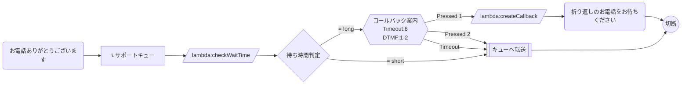

# コールバック予約フロー

待ち時間が長い場合に、顧客がコールバック（折り返し電話）を予約できるフロー。

## フロー概要

1. 着信→挨拶→キュー設定
2. 待ち時間を確認（GetQueueMetrics相当のLambda）
3. **待ち時間が長い場合**: コールバック希望か確認 → コールバックキューに登録
4. **待ち時間が短い場合**: そのままキュー転送

## Mermaid 設計図

## 実装のポイント

- `checkWaitTime` Lambda: キューの待ち時間を取得し、閾値（例: 300秒）を超える場合に `long` を返す
- `createCallback` Lambda: コールバックキューにエントリを作成（Amazon Connect のコールバック機能を使用）
- コールバック番号は発信者番号（`$.CustomerEndpoint.Address`）を自動使用
