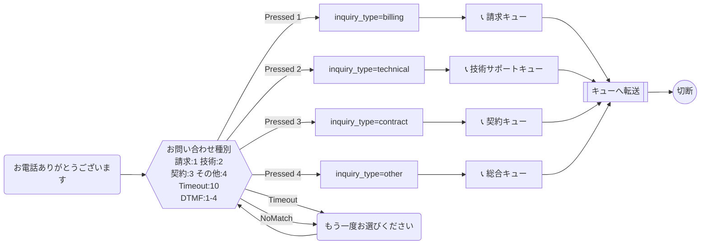

# 問い合わせ種別振り分けフロー

問い合わせの種類（請求・技術サポート・契約変更・その他）に応じて適切なキューに振り分けるフロー。

## フロー概要

1. 着信→挨拶
2. 問い合わせ種別をDTMFで選択（1〜4）
3. 種別に応じた属性設定 + キュー振り分け
4. キューへ転送

## Mermaid 設計図

## 実装のポイント

- `inquiry_type` 属性を設定することで、エージェントのCCP画面に問い合わせ種別が表示される
- リトライは1回のみ（無限ループ防止のため、実運用ではカウンタ属性で制御）
- 種別ごとにスキルベースルーティングを組み合わせると、より適切なエージェントにつながる
