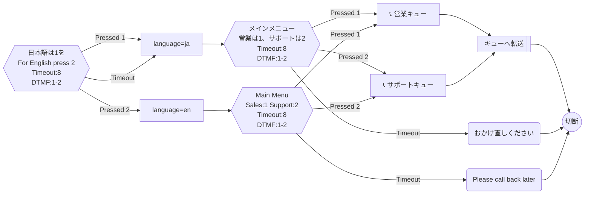

# 多言語対応フロー（日本語/英語）

着信時に言語を選択させ、選択した言語でIVRメニューを提供するフロー。

## フロー概要

1. 着信→言語選択（日本語は1、英語は2）
2. 言語に応じた音声テキスト設定（UpdateContactAttributes）
3. 各言語のIVRメニュー → キュー振り分け

## Mermaid 設計図

## 実装のポイント

- `UpdateContactAttributes` で `language` 属性を設定 → 後続のキュー転送やエージェントルーティングで活用
- Amazon Connect の「音声の設定」ブロックで Polly の言語/音声を切り替えることも可能（`SetVoice` ActionType）
- 言語ごとにキューを分ける場合は `q_sales_ja` / `q_sales_en` のように分離
