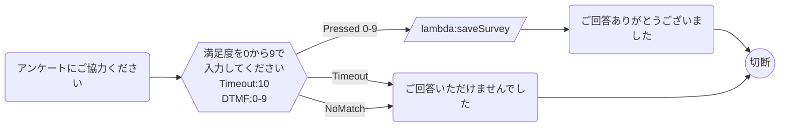

# 顧客満足度アンケート（NPS）フロー

通話終了後に顧客満足度アンケートを実施するフロー。0〜9のスコアを取得し、Lambda経由で記録する。

## フロー概要

1. アンケート案内メッセージ再生
2. NPS スコア入力（0〜9）
3. Lambda でスコアを記録
4. お礼メッセージ → 切断

## Mermaid 設計図

## 実装のポイント

- このフローは **転送先フロー（Customer Queue Flow）** または通話後の別フローとして使用
- `saveSurvey` Lambda: スコアをDynamoDBやCloudWatchメトリクスに記録
- NPSの計算: 9=推奨者、7-8=中立者、0-6=批判者として集計
- 属性にスコアを保存しておくとConnect分析でも活用可能
