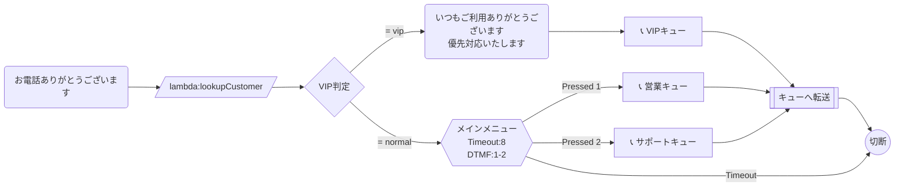

# エスカレーション（VIP顧客対応）フロー

発信者番号をLambdaで顧客DBと照合し、VIP顧客は優先キューへ、一般顧客は通常キューへ振り分けるフロー。

## フロー概要

1. 着信→挨拶
2. Lambda で顧客情報を照合（発信者番号ベース）
3. **VIP**: 優先キューへ転送（優先メッセージ付き）
4. **一般**: 通常のIVRメニューへ

## Mermaid 設計図

## 実装のポイント

- `lookupCustomer` Lambda: 発信者番号（`$.CustomerEndpoint.Address`）でDynamoDBを検索し、`customerLevel` を `vip` or `normal` で返す
- VIPキューにはConnect管理画面で高い優先度を設定
- 顧客名が取得できた場合は `vip_msg` に名前を含めることも可能（`UpdateContactAttributes` で属性セット後にテキスト内で参照）
