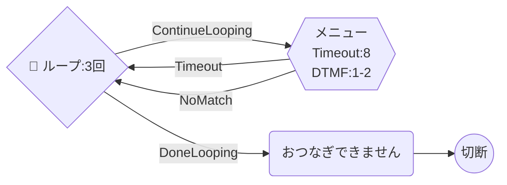
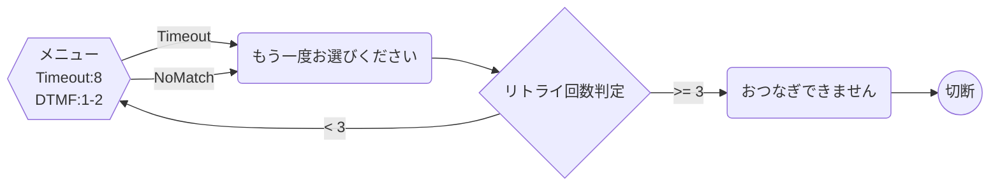
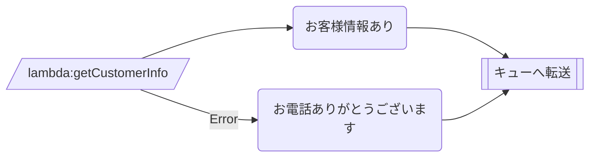
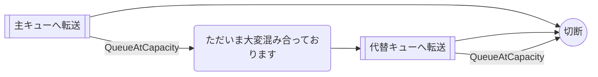
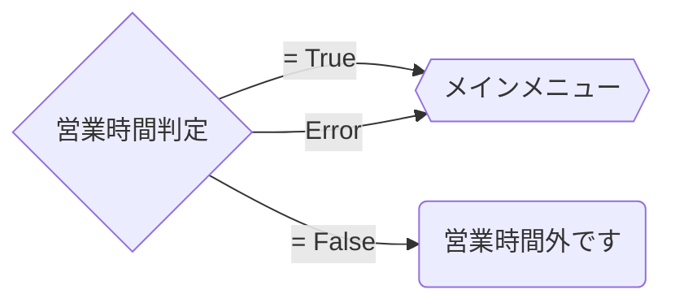

# Connect Blueprint — エラーハンドリングパターン集

## 基本原則

1. **すべてのActionにエラー遷移を設定する** — エラー未設定のActionがあるとフローが停止する
2. **最終的に必ず DisconnectParticipant に到達させる** — 無限ループやデッドエンドを防ぐ
3. **NoMatchingError は最後の砦** — 想定外エラーのキャッチオール

## ErrorType 一覧

| ErrorType | 発生するAction | 説明 |
|-----------|---------------|------|
| `NoMatchingError` | 全ActionType | 想定外のエラー（キャッチオール） |
| `NoMatchingCondition` | GetParticipantInput, Compare | どの条件にも一致しない入力 |
| `InputTimeLimitExceeded` | GetParticipantInput | 入力タイムアウト |
| `QueueAtCapacity` | TransferContactToQueue | キューが満杯 |
| `NoMatchingError` | InvokeLambdaFunction | Lambda実行エラー |

> **Note:** 完全な ErrorType 一覧は AWS MCP (`aws___read_documentation`) で各ActionTypeの公式ドキュメントを参照してください。上記は主要なもののみ記載しています。

### GetParticipantInput + StoreInput=True 時の ErrorType

`StoreInput: "True"` の場合、Conditions を使用しないため `NoMatchingCondition` は発生しない。

| ErrorType | 発生する | 説明 |
|-----------|:---:|------|
| `InputTimeLimitExceeded` | o | 入力タイムアウト |
| `NoMatchingError` | o | 想定外のエラー |
| `NoMatchingCondition` | - | Conditions 未使用のため発生しない |

## パターン1: リトライ付きIVRメニュー

入力エラー時に最大N回リトライし、超過したら切断する。

### 推奨: Loop ActionType 使用（自動カウント管理）



**実装方法**: `Loop` ActionType で `LoopCount` を指定。`ContinueLooping` 条件でメニューに遷移し、`DoneLooping` 条件でエラーメッセージに遷移する。カウンタの手動管理が不要。

### レガシー: UpdateContactAttributes + Compare（手動カウンタ）



**実装方法**: `UpdateContactAttributes` でカウンタ属性をインクリメントし、`Compare` で判定する。Loop ActionType が使えない場合の代替手段。

## パターン2: Lambda エラー時のフォールバック

Lambda失敗時は直接キューに転送する（機能を縮退させて継続）。



## パターン3: キュー満杯時のフォールバック

主キューが満杯の場合、代替キューまたはコールバックへ誘導する。



## パターン4: 営業時間チェックエラー時のデフォルト動作

CheckHoursOfOperation のエラー時は営業時間内として扱う（サービス優先）。



## アンチパターン

### エラー遷移なし
```json
{
  "Transitions": {
    "NextAction": "next-uuid"
  }
}
```
→ エラー発生時にフローが停止する。必ず `Errors` 配列を含める。

### 無限ループのリトライ
カウンタなしでエラー → 同じメニューに戻すと無限ループになる。
→ 必ず `Loop` ActionType またはカウンタで回数を制限する。

### DisconnectParticipant への遷移忘れ
全パスが最終的に DisconnectParticipant に到達することを確認する。
→ `scripts/validate.sh` でチェック可能。

### Conditions 欠落（分岐 ActionType）
`CheckHoursOfOperation` / `Compare` / `Loop` で Conditions を設定しないと、分岐が機能せず常に `NextAction`（デフォルト）に遷移する。
```json
{
  "Type": "CheckHoursOfOperation",
  "Transitions": {
    "NextAction": "default-uuid",
    "Errors": [{ "NextAction": "error-uuid", "ErrorType": "NoMatchingError" }]
  }
}
```
→ `CheckHoursOfOperation` には `True` / `False` の両 Conditions が必須。
→ `Loop` には `ContinueLooping` / `DoneLooping` の両 Conditions が必須。
→ `Compare` には最低1つの Conditions が必須。
→ `scripts/validate.sh` でチェック可能。
