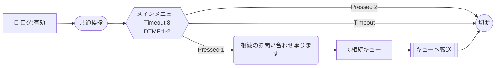

# Connect Blueprint — Mermaid 記法ガイド

## ノード形状 → ActionType マッピング

| 形状 | 構文 | ActionType |
|------|------|-----------|
| 六角形 | `id{{"テキスト"}}` | GetParticipantInput |
| 角丸四角 | `id("テキスト")` | MessageParticipant |
| ひし形 | `id{"テキスト"}` | Compare |
| 📞付き四角 | `id["📞 キュー名"]` | UpdateContactTargetQueue |
| 二重四角 | `id[["テキスト"]]` | TransferContactToQueue |
| 平行四辺形 | `id[/"lambda:関数名"/]` | InvokeLambdaFunction |
| 普通の四角 | `id["key=value"]` | UpdateContactAttributes |
| スタジアム | `id(["モジュール名"])` | InvokeFlowModule |
| 円 | `id(("切断"))` | DisconnectParticipant |
| ⏰付きひし形 | `id{"⏰ 営業時間"}` | CheckHoursOfOperation |
| 🔁付きひし形 | `id{"🔁 ループ:N回"}` | Loop |
| 🔊付き四角 | `id["🔊 音声名"]` | UpdateContactTextToSpeechVoice |
| 📝付き四角 | `id["📝 ログ:有効"]` | UpdateFlowLoggingBehavior |
| 🎙付き四角 | `id["🎙 録音:Agent,Customer"]` | UpdateContactRecordingBehavior |
| 📱付き二重四角 | `id[["📱 転送:番号"]]` | TransferToPhoneNumber |

## エッジ（遷移）

```
A --> B                    %% NextAction
A -->|"Pressed 1"| B       %% DTMF条件
A -->|"= true"| B          %% 属性比較条件
A -->|"ContinueLooping"| B %% ループ継続
A -->|"DoneLooping"| C     %% ループ完了
A -->|"Error"| C           %% エラー遷移
A -->|"Timeout"| C         %% タイムアウト
A -->|"NoMatch"| C         %% 不一致
```

## パラメータ埋め込み（ノードテキスト内）

```
id{{"メインメニュー\nTimeout:8\nDTMF:1-3"}}
```

- `Timeout:N` — タイムアウト秒数
- `DTMF:1-N` — 入力範囲
- `Queue:名前` — キュー名（ARNは自動解決）
- `Lambda:名前` — Lambda関数名（ARNは自動解決）
- `Attr:key=value` — 属性設定

## サンプル


